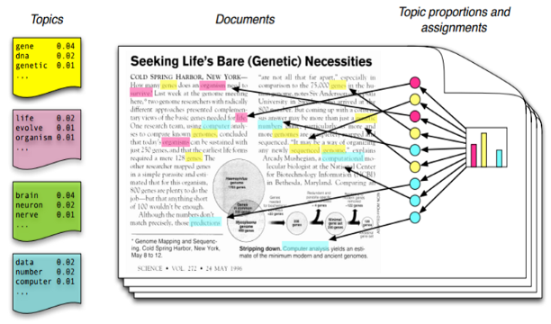
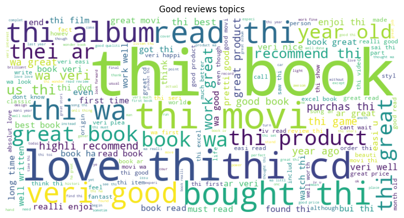
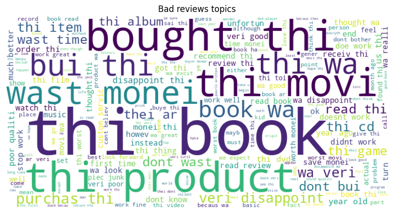
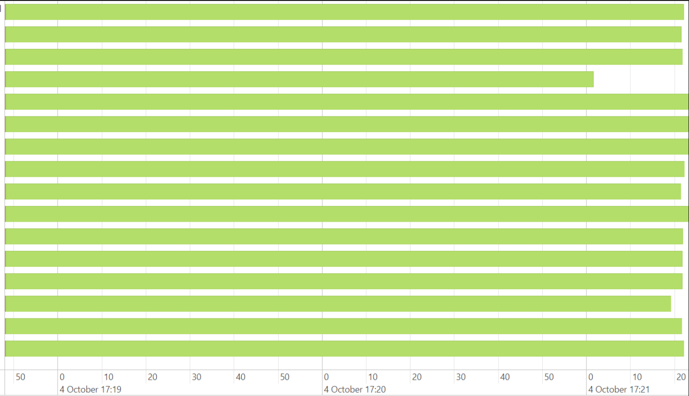

# Scalable NLP Analysis of 3.2 Million Amazon Reviews using PySpark and Spark-NLP
### All the analysis ran in just 14 minutes!!!

Kaggle's Amazon reviews dataset NLP topic analysis with Spark

Let's begin!

# PySpark NLP

## Introduction

The rise of e-commerce has led to an explosion of online reviews, with millions of customers sharing their opinions on products and services every day. Analyzing these reviews can provide valuable insights for businesses, helping them to understand customer sentiment, identify trends, and improve their products and services. However, processing and analyzing large volumes of text data can be a daunting task, requiring significant computational resources and expertise.

This project aims to demonstrate the power of scalable natural language processing (NLP) techniques in analyzing 3.2 million Amazon reviews. By leveraging the Apache Spark ecosystem and its Python API, PySpark, we can parallelize our workload and process large datasets efficiently. Specifically, we will use Spark-NLP, a library that provides high-performance NLP capabilities on top of Spark, to perform topic modeling and sentiment analysis on the review data.

The objective of this project is to tag comments with topics using Latent Dirichlet Allocation (LDA) clustering, a popular unsupervised learning technique for topic modeling. We will also employ term frequency-inverse document frequency (tf-idf) to transform our text data into a numerical representation that can be fed into our machine learning models. By applying these techniques at scale, we can uncover hidden patterns and trends in the review data, providing actionable insights for businesses and consumers alike.

The importance of this application lies in its ability to help businesses make data-driven decisions, improve customer satisfaction, and stay competitive in the market. By analyzing large volumes of review data, businesses can identify areas for improvement, optimize their product offerings, and develop targeted marketing strategies. Moreover, this project demonstrates the power of scalable NLP techniques in extracting insights from large datasets, highlighting the potential for similar applications in other domains, such as social media analysis, customer feedback analysis, and text classification.





## Objetive

In this exercise, we will perform an NLP analysis on 3.2 million Amazon reviews. Our objective is to tag comments with topics and use a PySpark pipeline (Apache Spark on Python) to parallelize our workload with the MapReduce engine.

You can replicate this code in a linux machine with the following toolbox:

* Data: https://www.kaggle.com/datasets/bittlingmayer/amazonreviews/data
* Java installed (linux in my case):
  - sudo apt update
  - sudo apt install default-jdk
  - check with: hava -version
* Spark installed (again linux in my case):
  - https://towardsdatascience.com/installing-pyspark-with-java-8-on-ubuntu-18-04-6a9dea915b5b
* Spark-nlp library: with pip
* PySpark library: with pip
* Wordcloud library: with pip


```python
!pip install -q pyspark==3.3.0 spark-nlp==4.2.8
!pip install wordcloud
```
## Set enviroment


```python
# Python imports
import sys
import os

# spark-nlp components
from sparknlp.annotator import Stemmer, Tokenizer, Normalizer
from pyspark.ml.feature import StopWordsRemover, CountVectorizer, IDF, SQLTransformer
from sparknlp.base import DocumentAssembler, Finisher
from pyspark.sql import SparkSession
# Datatypes
from pyspark.sql.types import DoubleType
from pyspark.ml import Pipeline
# Clustering
from pyspark.ml.clustering import LDA
# Functions
from pyspark.sql.functions import col, when, regexp_replace, udf
# Visualizations
import matplotlib.pyplot as plt
from wordcloud import WordCloud
from datetime import datetime

#Set JAVA_HOME (you can set it from CMD too)
os.environ['JAVA_HOME']='/home/jupyter/.sdkman/candidates/java/current'

# Build a local PySpark session with your machine specs (in my case, 64 Gb of RAM and 16 cores).
# The "spark.jars.packages" config: Allow PySpark to use SparkNLP jars for processing data.
spark = SparkSession.builder \
    .appName("Spark NLP")\
    .master("local[*]")\
    .config("spark.driver.memory","64g")\
    .config("spark.dynamicAllocation.enabled", False) \
    .config("spark.jars.packages", "com.johnsnowlabs.nlp:spark-nlp_2.12:5.0.2")\
    .getOrCreate()

conf = spark.sparkContext.getConf()

spark
```

## Processing pipeline


In this pipeline are the following steps:

* Creating labels column
* DocummentAssembler
* Tokenizing words
* Normalizing
* Stemming
* Removing stop words
* Extracting term frequency (TF)
* Inverse document frequency (IDF)
* LDA Clustering (build topics)
* Create column of most probable topic.


```python
start = datetime.now() #Processing time

data = spark.read.csv('train.ft.txt.bz2') #Read data

#Split data labels in a new column
data = data.withColumn("label", when(data["_c0"].contains("__label__1"), "1")
                               .when(data["_c0"].contains("__label__2"), "2")
                               .otherwise("0"))

#Delete label string in review text
data = data.withColumn("_c0", regexp_replace(col("_c0"), r"__label__\d+", ""))

# Document assembler for format text for an easier processing
document_assembler = DocumentAssembler().setInputCol("_c0").setOutputCol("document")

# Tokenize words, each word will be an unique string
tokenizer = Tokenizer().setInputCols(["document"]).setOutputCol("token")

# The Normalizer will group words together based on similar semantic meaning.
normalizer = Normalizer().setInputCols(["token"]).setOutputCol("normalizer")

# The Stemmer takes objects of class "Token" and converts the words into their
# root meaning. For instance, the words "cars", "cars'" and "car's" would all be replaced
# with the word "car".
stemmer = Stemmer().setInputCols(["normalizer"]).setOutputCol("stem")

# The Finisher signals to spark-nlp allows us to access the data outside of spark-nlp
# components. For instance, we can now feed the data into components from Spark MLlib.
finisher = Finisher().setInputCols(["stem"]).setOutputCols(["to_spark"]).setValueSplitSymbol(" ")

# Stopwords are common words that generally don't add much detail to the meaning
# of a body of text. In English, these are mostly "articles" such as the words "the"
# and "of".
stopword_remover = StopWordsRemover(inputCol="to_spark", outputCol="filtered")


pre_processing_pipeline = Pipeline(
    stages = [
        document_assembler,
        tokenizer,
        normalizer,
        stemmer,
        finisher,
        stopword_remover
    ]
)

preprocessing_model = pre_processing_pipeline.fit(data)

preprocessed_data = preprocessing_model.transform(data)


#Define topic extraction function
def extract_topics(df):

    # Here we implement TF-IDF as an input to our LDA model. CountVectorizer (TF) keeps track
    # of the vocabulary that's being created so we can map our topics back to their
    # corresponding words.
    # TF (term frequency) creates a matrix that counts how many times each word in the
    # vocabulary appears in each body of text. This then gives each word a weight based
    # on its frequency.
    tf = CountVectorizer(inputCol="filtered", outputCol="raw_features")

    # Here we implement the IDF portion. IDF (Inverse document frequency) reduces
    # the weights of commonly-appearing words.
    idf = IDF(inputCol="raw_features", outputCol="features")

    # LDA measures words frequency of appearing , for build topics
    # We are creating 10 topics for this example
    lda = LDA(k=10, maxIter=10)

    # From our topicDistribution column, extract the highest value
    # That will be our main topic for each review.
    def get_max_topic(topic_distribution):
        return float(topic_distribution.argmax())

    get_max_topic_udf = spark.udf.register("get_max_topic_udf", get_max_topic, DoubleType())

    # Get topic with max score
    sql_transformer = SQLTransformer(
        statement="SELECT *, get_max_topic_udf(topicDistribution) as maxTopic FROM __THIS__"
    )


    # We add all of the transformers into a Pipeline object.
    topic_pipeline = Pipeline(
        stages = [
            tf,
            idf,
            lda,
            sql_transformer
        ]
    )

    # We fit the data to the model.
    topic_model = topic_pipeline.fit(df)

    # Now that we have completed a pipeline, we want to output the topics as human-readable.
    # To do this, we need to grab the vocabulary generated from our pipeline, grab the topic
    # model and do the appropriate mapping.  The output from each individual component lives
    # in the model object. We can access them by referring to them by their position in
    # the pipeline via model.stages[<ind>]

    # Let's create a reference our vocabulary.
    # Get the "tf" stage and extract vocabulary
    vocab = topic_model.stages[-4].vocabulary
    #Get topics
    raw_topics = topic_model.stages[-2].describeTopics().collect()

    #Get most frequent words in each topic
    topic_inds = [ind.termIndices for ind in raw_topics]

    # The indices we just grab directly map to the term at position <ind> from our vocabulary.
    # Using the below code, we can generate the mappings from our topic indices to our vocabulary.
    topics = []
    for topic in topic_inds:
        _topic = []
        for ind in topic:
            _topic.append(vocab[ind])
        topics.append(_topic)

    # Let's see our topics!
    for i, topic in enumerate(topics, start=0):
        print(f"topic {i}: {topic}")

    results = topic_model.transform(df)

    # Show results
    results.show()

    return results

good_results = extract_topics(preprocessed_data.filter(data.label == "2")) #topics for good reviews
print(datetime.now() - start) #Print execution time for good reviews

bad_results = extract_topics(preprocessed_data.filter(data.label == "1")) #Topics for bad reviews

print(datetime.now() - start) # Print execution time for bad reviews
```                                              
    Good reviews topics:

    topic 0: ['book', 'read', 'thi', 'wa', 'hi', 'veri', 'stori', 'ar', 'excel', 'movi']
    topic 1: ['movi', 'music', 'thi', 'wa', 'book', 'best', 'good', 'film', 'great', 'album']
    topic 2: ['game', 'movi', 'fun', 'love', 'great', 'thi', 'cd', 'ar', 'toi', 'wa']
    topic 3: ['wa', 'thi', 'great', 'love', 'us', 'veri', 'good', 'product', 'thei', 'bought']
    topic 4: ['album', 'cd', 'wa', 'thi', 'song', 'great', 'book', 'rock', 'ar', 'good']
    topic 5: ['book', 'read', 'stori', 'thi', 'wa', 'great', 'love', 'ar', 'life', 'wonder']
    topic 6: ['good', 'great', 'thi', 'movi', 'wa', 'nice', 'book', 'ar', 'veri', 'well']
    topic 7: ['workout', 'thi', 'book', 'great', 'veri', 'us', 'wa', 'work', 'love', 'good']
    topic 8: ['book', 'food', 'wa', 'great', 'thi', 'us', 'good', 'ic', 'ar', 'pen']
    topic 9: ['work', 'us', 'great', 'product', 'thi', 'veri', 'good', 'easi', 'camera', 'wa']
    23/10/04 16:43:11 WARN DAGScheduler: Broadcasting large task binary with size 26.9 MiB

    Bad reviews topics:

    topic 0: ['cd', 'album', 'song', 'dvd', 'thi', 'wa', 'like', 'ar', 'music', 'thei']
    topic 1: ['game', 'wa', 'thi', 'film', 'movi', 'good', 'sound', 'ar', 'like', 'music']
    topic 2: ['book', 'read', 'wa', 'thi', 'bore', 'hi', 'stori', 'dont', 'like', 'good']
    topic 3: ['product', 'wa', 'us', 'thi', 'work', 'thei', 'veri', 'get', 'item', 'batteri']
    topic 4: ['book', 'wa', 'thi', 'read', 'ar', 'movi', 'veri', 'review', 'thei', 'good']
    topic 5: ['movi', 'book', 'wa', 'thi', 'ar', 'stori', 'bad', 'worst', 'ever', 'read']
    topic 6: ['thi', 'wa', 'bui', 'drive', 'product', 'dont', 'bad', 'book', 'mac', 'dvd']
    topic 7: ['work', 'month', 'us', 'thi', 'phone', 'toi', 'window', 'wa', 'product', 'broke']
    topic 8: ['leak', 'wa', 'thi', 'us', 'bag', 'bought', 'year', 'ok', 'hair', 'product']
    topic 9: ['wa', 'us', 'thi', 'work', 'product', 'defect', 'thei', 'week', 'time', 'month']
    23/10/04 16:50:15 WARN DAGScheduler: Broadcasting large task binary with size 27.0 MiB
    
    execution time: 0:14:09 (hh:mm:ss)
    

                                                                                    


```python
# Show comments per topic

def show_topics_grouped(results):
    pivot_table = results.groupBy("maxTopic").agg({"_c0": "count"})
    pivot_table = pivot_table.orderBy("maxTopic")
    return pivot_table.show()

show_topics_grouped(good_results) #Good topics
show_topics_grouped(bad_results) #Bad topics
```

    Good topics
    +--------+----------+
    |maxTopic|count(_c0)|
    +--------+----------+
    |     0.0|    283383|
    |     1.0|    168646|
    |     2.0|    213833|
    |     3.0|    321662|
    |     4.0|    193300|
    |     5.0|    190844|
    |     6.0|     63909|
    |     7.0|     94024|
    |     8.0|     57099|
    |     9.0|    213300|
    +--------+----------+
    
    Bad topics
    +--------+----------+
    |maxTopic|count(_c0)|
    +--------+----------+
    |     0.0|    186560|
    |     1.0|    142342|
    |     2.0|    263798|
    |     3.0|    421948|
    |     4.0|    161930|
    |     5.0|    279442|
    |     6.0|     56893|
    |     7.0|    118622|
    |     8.0|     69419|
    |     9.0|     99046|
    +--------+----------+
    
    

                                                                                    


## Review topics in a word cloud


```python
#Good reviews word plot
text_data = good_results.select("filtered").rdd.flatMap(lambda x: x).collect()

text_data_flat = [item.strip() for sublist in text_data for item in sublist]

# Join all texts
text_combined = " ".join(text_data_flat)

# Generate wordcloud
wordcloud = WordCloud(width=800, height=400, background_color="white").generate(text_combined)

# Show wordcloud
plt.figure(figsize=(10, 5))
plt.imshow(wordcloud, interpolation="bilinear")
plt.axis("off")
plt.title("Good reviews topics")
plt.show()
```

                                                                                    


    

    


```python
#Bad reviews word plot
text_data = bad_results.select("filtered").rdd.flatMap(lambda x: x).collect()

text_data_flat = [item.strip() for sublist in text_data for item in sublist]

# Join strings
text_combined = " ".join(text_data_flat)

# Generate wordcloud
wordcloud = WordCloud(width=800, height=400, background_color="white").generate(text_combined)

#show wordcloud
plt.figure(figsize=(10, 5))
plt.imshow(wordcloud, interpolation="bilinear")
plt.axis("off")
plt.title("Bad reviews topics")
plt.show()

```

    

    

```python
#Save good reviews results in local memory
good_results.select('_c0', 'label', 'maxTopic').write.option("compression", "snappy").mode("overwrite").parquet("/home/jupyter/good_results")
```


```python
#Save bad reviews results in local memory
bad_results.select('_c0', 'label', 'maxTopic').write.option("compression", "snappy").mode("overwrite").parquet("/home/jupyter/bad_results")
```

    23/10/04 17:21:23 WARN DAGScheduler: Broadcasting large task binary with size 27.2 MiB
    

                                                                                    


## What can we do with topics?

Now we can rename the topics in order to add readability, in example, for good reviews topics:

* topic 0 (Good books-movies): ['book', 'read', 'thi', 'wa', 'hi', 'veri', 'stori', 'ar', 'excel', 'movi']
* topic 1 (Good music-movies): ['movi', 'music', 'thi', 'wa', 'book', 'best', 'good', 'film', 'great', 'album']
* topic 3 (Great products): ['wa', 'thi', 'great', 'love', 'us', 'veri', 'good', 'product', 'thei', 'bought']
* topic 5 (Wonderful stories): ['book', 'read', 'stori', 'thi', 'wa', 'great', 'love', 'ar', 'life', 'wonder']
* topic 8 (Great food-books): ['book', 'food', 'wa', 'great', 'thi', 'us', 'good', 'ic', 'ar', 'pen']
* topic 9 (Great products): ['work', 'us', 'great', 'product', 'thi', 'veri', 'good', 'easi', 'camera', 'wa']

for bad reviews topics:

* topic 0 (bad music-albums): ['cd', 'album', 'song', 'dvd', 'thi', 'wa', 'like', 'ar', 'music', 'thei']
* topic 1 (bad games-movies): ['game', 'wa', 'thi', 'film', 'movi', 'good', 'sound', 'ar', 'like', 'music']
* topic 3 (useless products): ['product', 'wa', 'us', 'thi', 'work', 'thei', 'veri', 'get', 'item', 'batteri']
* topic 4 (bad books - movies): ['book', 'wa', 'thi', 'read', 'ar', 'movi', 'veri', 'review', 'thei', 'good']
* topic 5 (worst stories): ['movi', 'book', 'wa', 'thi', 'ar', 'stori', 'bad', 'worst', 'ever', 'read']
* topic 7 (bad toys-phones): ['work', 'month', 'us', 'thi', 'phone', 'toi', 'window', 'wa', 'product', 'broke']
* topic 8 (bad hair products): ['leak', 'wa', 'thi', 'us', 'bag', 'bought', 'year', 'ok', 'hair', 'product']


## Next steps

With the topic already in our data, we can segment reviews and perform different analyses such as:

* Performing Aspect-Based Sentiment Analysis (ABSA) in order to find specific reasons for a good or bad review in each category.

* Generating a report with the principal failures in each category and prescriptive actions.

* Provide feedback to product sellers about the good and bad aspects associated with their products (topics).

## Conclusions

With this NLP analysis, we can label and identify topics in comments, reviews, or other types of texts. This is useful for clustering comments by categories and, in this particular case, identifying reasons for a good or bad review.

We have taken advantage of PySpark's parallelism on 16 cores. It allows us to analyze 3.2M rows of reviews in 14 minutes, with the possibility of horizontal scaling for faster processing in a machine's cluster (like Google Cloud Dataproc). Here is a picture showing the partition processing of one step in the PySpark cluster, each green bar is the processing time for each core (only the fourth core is slightly underbalanced in data):


